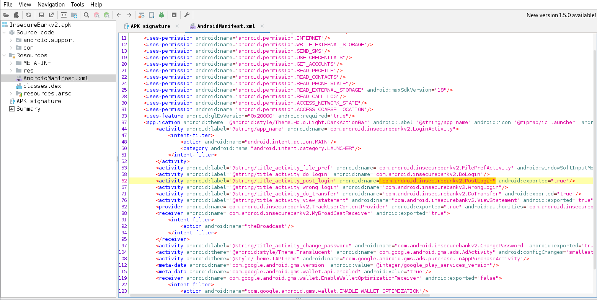
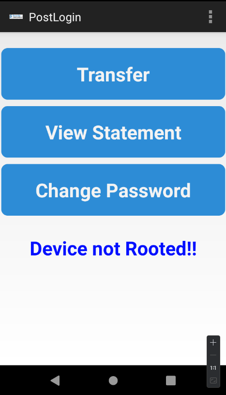

# Bypass na lógica de autenticação do usuário

## Descrição

A validação do usuário no código fonte pode ser ***bypassado*** burlando a lógica de funcionamento do aplicativo. Analisando o documento androidmanifet.xml, pode-se verificar a atividade exportada **"post.login"** abaixo da **Dologin**. Desta forma pode-se presumir que esta é a responsavel por liberar o acesso do usuário. Quando executada diretamente via adb, o aplicativo pula a etapa de verificação de login e senha e leva o atacante direto para o ambiente do usuário. 

## Referências 

https://mas.owasp.org/MASTG/General/0x04e-Testing-Authentication-and-Session-Management/

https://mas.owasp.org/MASTG/techniques/android/MASTG-TECH-0007/

https://mas.owasp.org/MASTG/techniques/android/MASTG-TECH-0014/

https://book.hacktricks.xyz/mobile-pentesting/android-app-pentesting

https://mas.owasp.org/MASVS/07-MASVS-AUTH/


## Impacto

O impacto vai depender das funcionalidades do aplicativo que estão sob acesso do atacante não autorizado. No aplicativo em questão foi possível acessar todos os recursos disponíveis para um usuário comum.

## Prova de conceito

Esta falha pode ser validada após o reconhecimento das atividades registradas no arquivo da liguagem de marcação androidmanifest.xml que ser consultado via debuging no JADX.



Com a informação da atividade, basta executar o comando utilizando a ferramenta adb, com a seguinte comando:

```
adb shell am start -n com.android.insecurebankv2/com.android.insecurebankv2.PostLogin
```
No ambiente de teste anexado podemos verificar que o aplicativo foi para a area do cliente sem necessidade do inserir usuário e senha.




# Ação sugerida para mitigação

Problemas de autenticação são vulnerabilidades de segurança encontrados em grande parte de dispositivos móveis, eles ocupam consistentemente o segundo lugar no Top 10 da OWASP. Pensando nisso, mostramos forma de mitigar falhas na autenticação de aplicativos.

## Autenticação via servidor

Exigir a autenticação do usuário para aplicativos que se conectam a um endpoint remoto e garantir que essa comunicação seja feita de forma criptografada.  

Aplicação destes mecanismos de autenticação devem estar no endpoint remoto.


