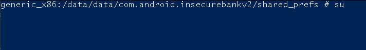
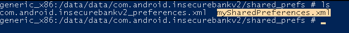
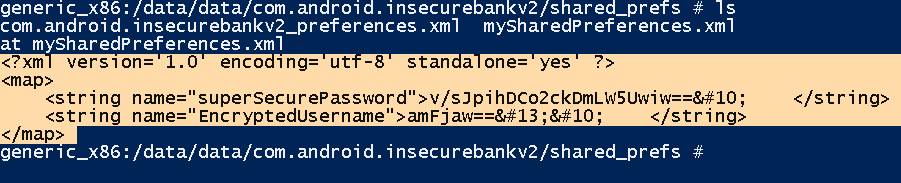
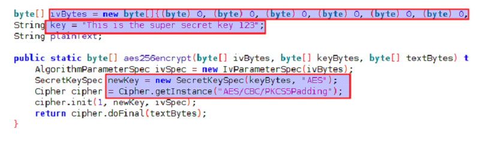
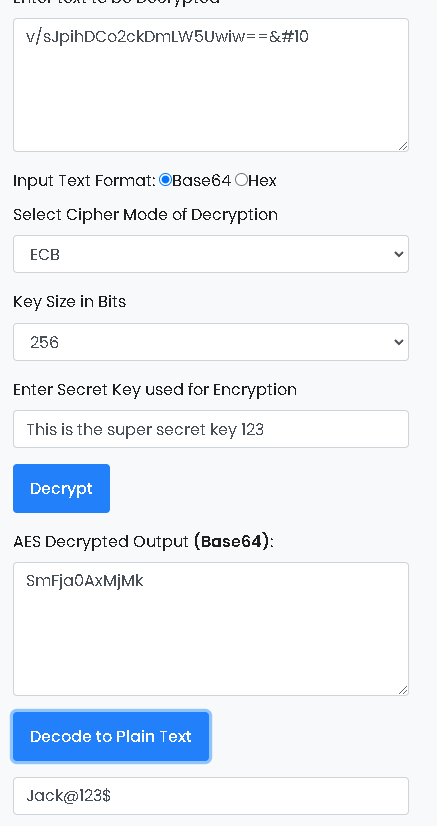

# Explorando a fraca criptografia do programa

## Descrição

Quando uma chave criptográfica é codificada dentro de um aplicativo Android, isso significa que a chave está diretamente incorporada no código-fonte do aplicativo. Podemos explorar essa vulnerabilidade explorando um diretório específico no sistema de arquivos do dispositivo onde são armazenados arquivos de preferências compartilhadas para o aplicativo "com.android.insecurebankv2".

## Referências

https://redfoxsec.com/blog/broken-cryptography-android-applications/

https://blog.quarkslab.com/android-data-encryption-in-depth.html

https://mas.owasp.org/MASTG/tests/android/MASVS-CRYPTO/MASTG-TEST-0013/

https://mas.owasp.org/MASVS/06-MASVS-CRYPTO/

## Impacto

O impacto da vulnerabilidade de criptografia fraca no aplicativo InsecureBankv2 pode ser significativo e abrangente, como o roubo de credenciais, perde de confiança de usuários, com acesso a informações pessoais dos usuários, os invasores podem realizar atividades de roubo de identidade, como abrir contas falsas em nome dos usuários ou realizar transações financeiras fraudulentas. O que se encaixa exatamente em nosso cenário, afinal, é um banco.

## Prova de conceito

A conclusão de que a vulnerabilidade de criptografia está presente em um determinado diretório, “**/data/data”**, é resultado de análise comportamento do aplicativo. Muitos aplicativos armazenam dados sensíveis, como informações de login, tokens de autenticação e outros dados confidenciais, dentro de seus diretórios em **“/data/data”**

Portanto precisamos nos conectar no emulador, e interagir com o S.O

```
adb shell

```

Ao rodarmos o comando, o adb shell, temos acesso ao Android, e seguido as requisições de chamada, do Manifest, chegamos ate o **‘shared_prefs’,** logo, precisamos acessar esse diretório para explorar ainda mais a vulnerabilidade

Vamos utilizar o comando para ir no diretório desejado dentro do sistema Android e verificar o que há no diretório:

```
 cd /data/data/com.android.insecurebankv2/shared_prefs/
 
 *precisamos de privilégios, podemos usar o su*

generic_x86:/data/data/com.android.insecurebankv2/shared_prefs # **ls**

```





Como visto, podemos observar que há um SharedPreferences.xml, que possivelmente pode haver dados sensíveis.

```
generic_x86:/data/data/com.android.insecurebankv2/shared_prefs # cat mySharedPreferences.xml

```

Assim, teremos uma  “Senha super secreta “ e um “Username criptografado”



Vamos extrair o conteúdo do arquivo:

```bash
unzip InsecureBankv2.apk
```

Podemos analisar o arquivo: 

Ou seja, temos a chave AES, logo, podemos  “decodar” a senha e o usuário que estava dentro do XML.



Correlacionamos com o usuário e logamos no sistema.



## Mitigação

O aplicativo deverá realizar o gerenciamento de chaves de acordo com as melhores práticas, pois
mesmo a criptografia mais forte seria comprometida por um gerenciamento inadequado de chaves, que é o nosso caso neste exemplo.

Realizar o gerenciamento de chaves da criptografia durante todo o seu ciclo, incluindo geração, armazenamento e proteção de chaves.


