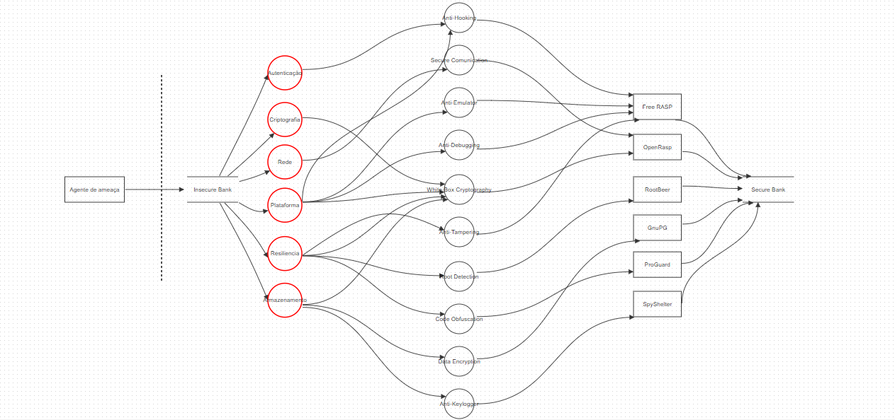

# Apresentação: Sprint 2 - Hakai Challenge

## Introdução
Nossa equipe Red Ribbon tem o prazer de apresentar o desenvolvimento do RASP para o Hakai Challenge. Este desafio irá proporcionar uma oportunidade de explorar e mitigar vulnerabilidades em aplicativos móveis, contribuindo para a segurança digital.

## Grupo Red Ribbon
- **Membros da Equipe:**
  - Matheus Rosa
  - Henrique Koji
  - Felipe Madeira
  - Pedro Augusto
  - Caio Vinícius

- **Descrição:**
A Red Ribbon é uma organização que presta serviços relacionados à aplicações mobile usando uma solução RASP SDK (Runtime Application Self-Protection).

## Pesquisa em cima do aplicativo
- **Abordagem Adotada:**
  - Estudo detalhado das vulnerabilidades encontradas no aplicativo InsecureBankv2
  - Escolha das melhores soluções
  - Implementação

- **Etapas da Implemetação:**

- ## Diagrama
  

## Resultados
- **Overview dos Relatórios:**

## Conclusão

- **Agradecimentos:**
  Agradecemos à Hakai Security pela oportunidade de participar deste desafio e aos avaliadores por seu tempo e consideração.

 

