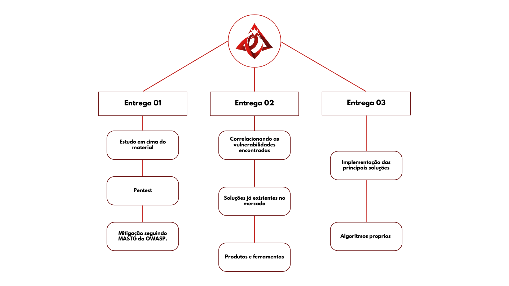

# Roadmap até aqui!

## Feitas

- Anti-Debugger: Implementar mecanismos que detectam tentativas de depuração e fecham o aplicativo se essas tentativas forem identificadas.

- Anti-Root: Adicionar verificações para identificar dispositivos com acesso root e impedir a execução do aplicativo em tais dispositivos. Assegurar que o aplicativo seja executado apenas em dispositivos não comprometidos.

- Criptografia de Dados Locais: Implementar criptografia robusta para dados armazenados localmente no dispositivo, garantindo que informações sensíveis estejam protegidas contra acesso não autorizado.

- Ofuscação: Utilizar técnicas de ofuscação para proteger o código do aplicativo contra engenharia reversa. Isso envolve a modificação dos nomes de classes e métodos para tornar o código mais difícil de ser compreendido por atacantes.

## Em progresso
Hashing: Adicionar verificação de integridade dos arquivos críticos do aplicativo, como MainActivity e build.gradle, calculando e comparando hashes para detectar modificações não autorizadas.

Certificado SSL: Implementar e garantir a utilização de certificados SSL para criptografar as comunicações entre o aplicativo e os servidores, protegendo os dados em trânsito contra interceptação e adulteração.

Com a implementação dessas soluções, nosso objetivo é fortalecer a segurança do aplicativo e proporcionar uma proteção eficaz contra ameaças em tempo real.

## A fazer 

Unir todos os arquivos, configruacoes e solucoes em uma biblioteca chamada Red Ribbon. Com o intuito de realizar o import e utilizar tudo como funcoes da lib RR.
