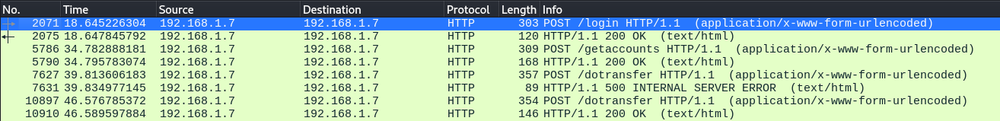
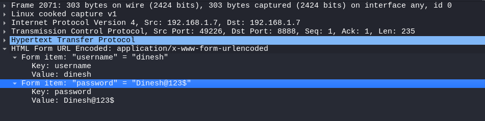

# Interceptação de dados transmitidos por protocolo inseguro

## Descrição

O protocolo de transporte de menssagem HTTP inseguro permite que atacantes interceptem menssagens trocadas entre o servidor e o aplicativo cliente, possibilitando o roubo de credenciais, extração de informação ou quebra na integridade da mesma.

## Referências

https://mas.owasp.org/MASTG/General/0x04f-Testing-Network-Communication/

https://car.mitre.org/analytics/CAR-2020-11-002/

https://portswigger.net/web-security/request-smuggling/exploiting

## Impacto

Caso esteja na mesma rede que o alvo, uma gente malicioso pode realizar um ataques de sniff e interceptar todo o tráfego em texto claro. Isso pode culminar em captura de senhas e nomes de usuáios e alteração nas informações trocadas entre cliente e servidor.

## Prova de conceito

Para realizar este ataque é necessário que o agente de ameaça esteja na mesma rede no usuário alvo. Depois de indentificar o dispositivo da vítima basta realizar a interceptação utilizando os seguintes comandos. 

```
echo 1 > /proc/sys/net/ipv4/ip_foward
```

```
arpspoof -i <nome da interface de rede> -t <ip atribuido ao dispositivo alvo> <ip do gateway>
```

```
arpspoof -i <nome da interface de rede> -t <ip do gateway> <ip atribuído ao dispositivo alvo>
```

Isso vai colocar o dispositivo de ataque entre o alvo e a conexão com a internet capturando todo o tráfego de comunicação. Com esta posição basta iniciar o wireshark e esperar que individo tente realizar o login.



Como o protocolo de comunicação do aplicativo é inseguro, o atacante poderá verificar em texto claro as informações enviados para o serviço.




## Ação sugerida para mitigação

Para garantir a confidencialidade e a integridade dos dados em trânsito na rede, deve levar em conta a criptografia e a autenticação do endpoint remoto, como por meio de uso de TLS-*Transport Layer Security*

A verificação do uso de protocolos seguros e criptografados, como por exemplo o uso de ssl na comunicação https ao invés do http que foi utilizado pelo aplicativo e nos permitiu a exploração e a interceptação doa dados trafegados.
