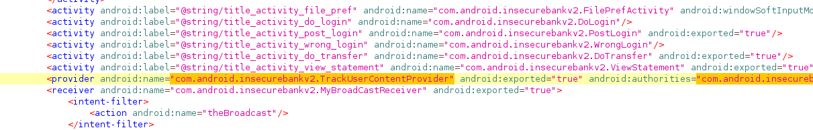
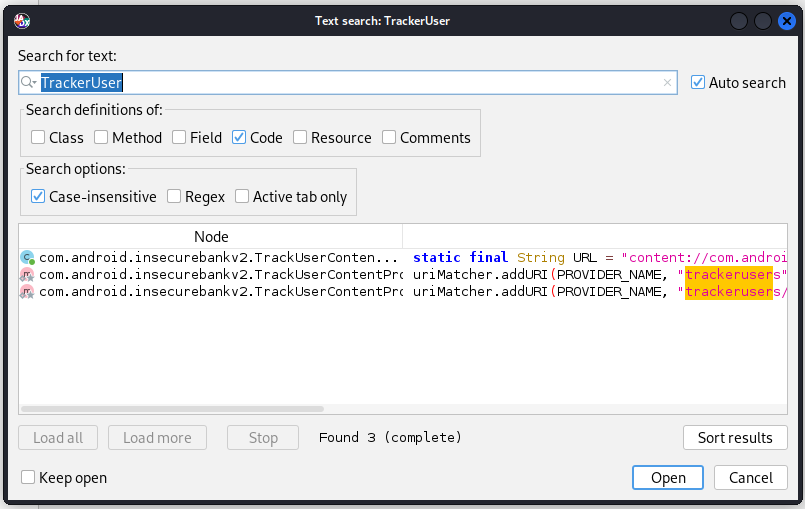
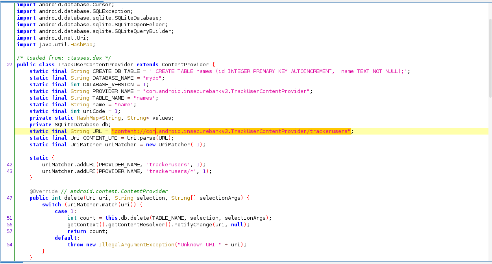
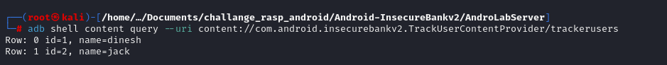

# Acesso não autorizado ao provedor de conteúdo do aplicativo

## Descrição

O provedor de conteúdo que permite compartilhar dados entre usuáros e sistema do aplicativo é acessível e consultável por qualquer pessoa de posse do aplicativo. A falha possibilita a enumeração dos usuários registrados localmente e pode culminar em vazamento de dados sensíveis.

## Referências 

https://mas.owasp.org/MASTG/Android/0x05h-Testing-Platform-Interaction/#permission-enforcement

https://blog.oversecured.com/Content-Providers-and-the-potential-weak-spots-they-can-have/

https://developer.android.com/guide/topics/providers/content-provider-basics

https://medium.com/@paritasampa95/content-provider-in-android-07d499cf7539


## Impacto

A vulnerabilidade pode estar associada a vazamento de dados, exposição não intencional, além de ser uma superficíe de ataque para injeção SQL e escalação de permissões.

## Prova de conceito

Com acesso ao arquivo AndroidManifest.xml é possóvel identificar a existencia de um receptor de broadcast no aplicativo.



A verificação anterior possibilita encontrar a localização da classe por meio da ferramenta de pesquisa no JadX. 



Dessa forma se obtem a URI para testar o acesso e tentar obter algumas informações compartilhadas pelo aplicativo.



O levantamento das informações possibilita a consulta com a ferramenta **adb** com o seginte comando:

```
adb shell content query --uri content://com.android.insecurebankv2.TrackUserContentProvider/trackerusers
```

O retorno será a lista de usuários logados no aplicativo e seus respectivos ids. 



## Ação sugerida para mitigação
