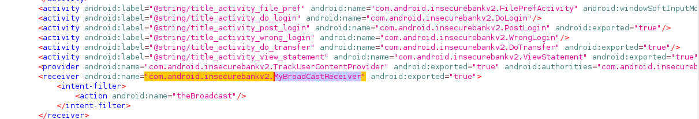
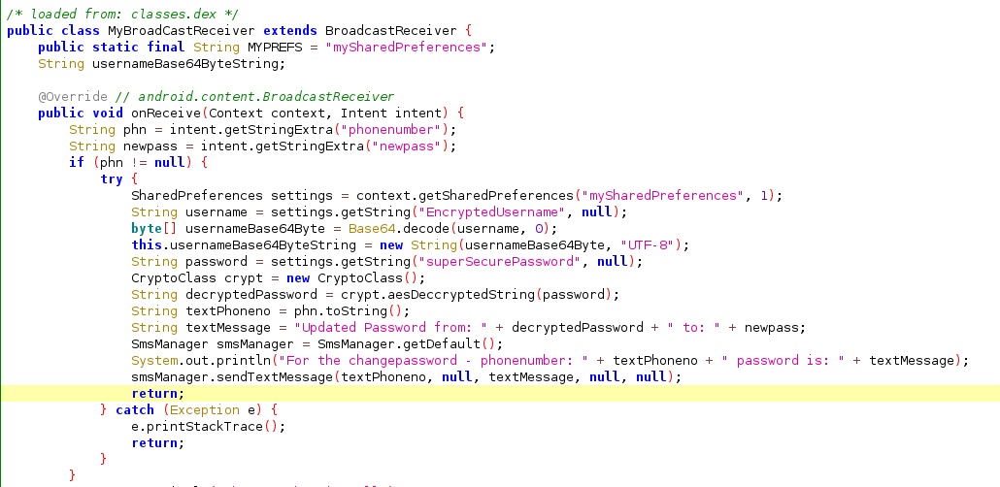
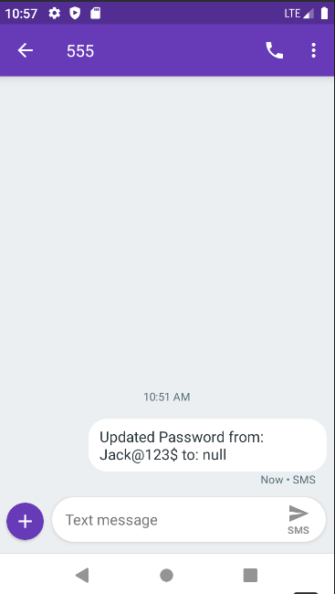

# Credenciais vazadas por meio de redefinição de senha

## Descrição

O receptor de broadcast exposto no AndroidManifest.xml permite que um agente malicioso de posse do aplicativo, recupere ou resete a senha da vítima sem as devidas permissões. 

## Referências

https://mas.owasp.org/MASTG/tests/android/MASVS-PLATFORM/MASTG-TEST-0029/

https://developer.android.com/privacy-and-security/risks/insecure-broadcast-receiver

https://book.hacktricks.xyz/mobile-pentesting/android-app-pentesting

## Impacto

De posse do dispositivo da vítima, um atacante pode recuperar ou resetar a senha do invíduo e conseguir acesso ao aplicativo com suas informações.

## Prova de conceito

Após decompilar o apk na ferramenta JadX, é possível verificar receptor de broadcast declarado. 



Com a informação, basta utilizar o mecanismo de busca da ferramenta para localizar e verifar a utilizadade da função. Pode-se perceber que se trata da redefinição da senha do usuário.



No adb, pode-se chamar a função diretamente, com o seguinte comando:

```
adb shell am broadcast -a theBroadcast -n com.android.insecurebankv2/.MyBroadCastReceiver --es phonenumber 555 521-5554  --es newpass N3wP@ss
```
No dispositivo alvo pode-se verificar que uma mensagem foi recebida com as credenciais do alvo em questão.




## Ação sugerida para mitigação
