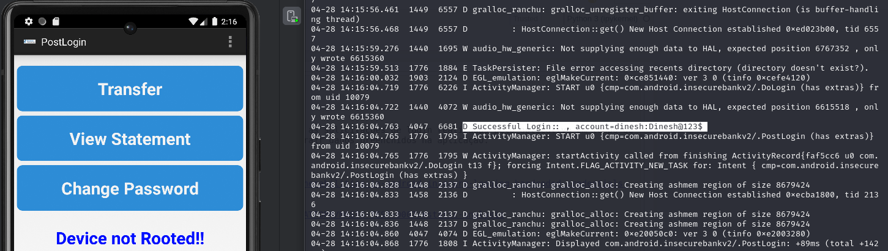

# Interceptação de credenciais por meio de resgistro inseguro

## Descrição

Registro inseguro permite a interceptação de todas as solicitações de login realizadas pelo aplicativo em tempo de execução. Com acesso ao dispositivo é possível extrair dados preenchidos na aplicação.

## Referências

https://medium.com/@prnz_offl/exploring-common-vulnerabilities-in-android-insecure-logging-hardcoded-credentials-insecure-data-a3c9e0cb2611

https://mas.owasp.org/MASTG/tests/android/MASVS-PLATFORM/MASTG-TEST-0007/#static-analysis

## Impacto

Com acesso ao dispositivo da vítima o atacante pode recuperar suas credenciais por meio deste ataque caso o disposistivo tenha as informações armazenadas.

## Prova de conceito

Com o disposistivo alvo funcionando e conectado na maquina de ataque basta inciar uma escuta por meio da ferramenta de debugger do android com a seguinte comando:

```
adb logcat
```
Depois disso, basta preencher o formulário de login com a opção de inserir as informações automáticamente. Nos registro interceptados pela shell é possível ver os dados do usuário em texto simples.



## Ação sugerida para mitigação
