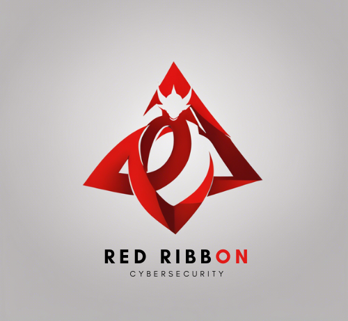

# Hakai Challenge
Na primeira fase, as equipes são encarregadas de desenvolver sua própria solução de RASP (Runtime Application Self-Protection). O RASP é uma tecnologia avançada de segurança que se integra diretamente ao código de um aplicativo, operando em tempo real para identificar e bloquear
ameaças.

## Grupo Red Ribbon

### Sobre nós
A Red Ribbon é uma organização que presta serviços relacionados à aplicações mobile usando uma solução RASP SDK (Runtime Application Self-Protection).

### Integrantes

- Matheus Rosa
- Henrique Koji
- Felipe Madeira
- Pedro Augusto
- Caio Vinícius

## Entrega 
Realizamos alguns Pentests no aplicativo mobile pela Hakai (InsecureBankv2) e elaboramos relatórios detalhados que estão organizados em pastas nomeadas por técnicas do MASTG (OWASP) e mitigações do MASVS (OWASP) neste repositório. Cada pasta contém:

- Descrição da vulnerabilidade: Detalhes sobre a vulnerabilidade identificada, incluindo como ela foi explorada e potenciais impactos.
- Mitigação: Sugestões e recomendações para mitigar ou corrigir a vulnerabilidade encontrada.
- Código contra vulnerabilidade: Exemplos de código ou instruções para implementar correções ou melhorias de segurança no aplicativo.
  
Este repositório serve como registro das análises de segurança realizadas pela nossa equipe durante a fase de desenvolvimento do RASP para o desafio Hakai.

{: width="100px"}

