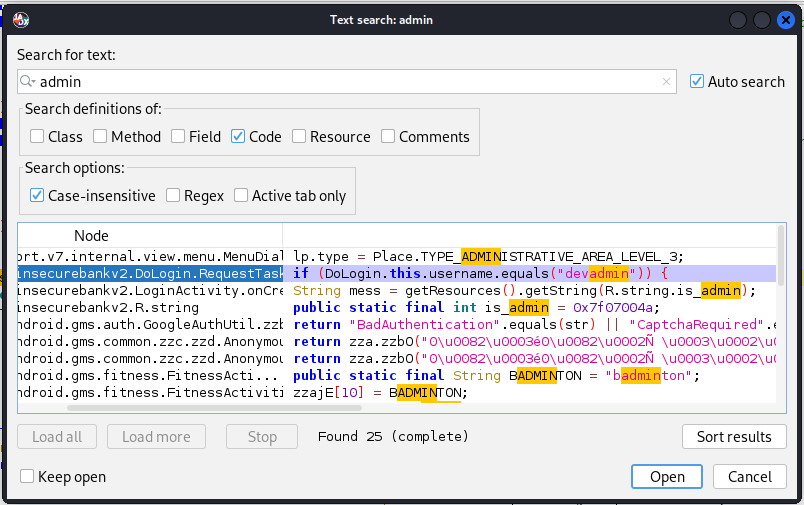
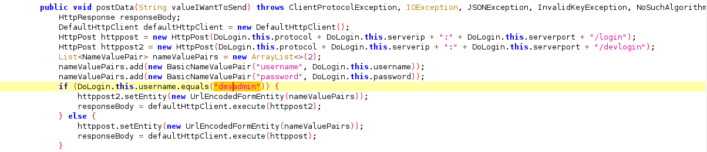
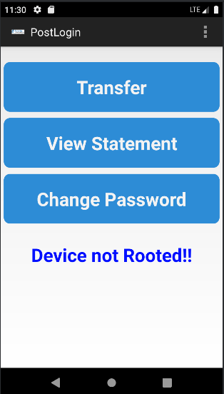

# Código fonte expõe credenciais de acesso deixadas pelo desenvolvedor

## Descrição

A possibilidade de decopilação do código fonte pode levar a conseguir credenciais para acesso deixadas pelo desenvolvedor. Isso permite que qualquer pessoa sem registro, mas de acesso ao código fonte, consiga uma forma legítima, mas não autorizada a area do cliente.

## Referências

https://mas.owasp.org/MASTG/General/0x04c-Tampering-and-Reverse-Engineering/

https://mas.owasp.org/MASTG/techniques/generic/MASTG-TECH-0047/

https://www.kali.org/tools/jadx/

## Impacto

O acesso legítimo com contas de desenvolvimento pode possibilitar a algum atacante ações que violam os principios de nãorepudio e sequestro de identidade nas atividades do aplicativo.

## Prova de conceito

Depois de compilar o apk com a ferramenta JadX, se faz uma busca no mecanismo atrá de palavra como ***"admin"***.

Nesta fase de reconhecimento, é possível verificar uma condicional que indica a existencia de um login chamado devadmin que não exige credenciais.

Ao testa-la no formulário foi possível ter acesso a uma área de cliente.

## Ação sugerida para mitigação

O acesso a componentes internos do aplicativo pode levar ao vazamento de dados e credenciais de controle, além de permitir ao atacante, obter a compreenção do funcionamento do código. 

Revisar o código, com a finalidade de evitar o esquecimento de dados de desenvolvimento e implementar técnicas de antianálise estática para de dificultar este entendimento por parte dos atacantes.
