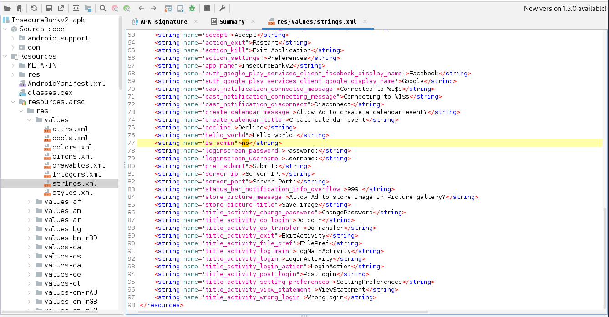
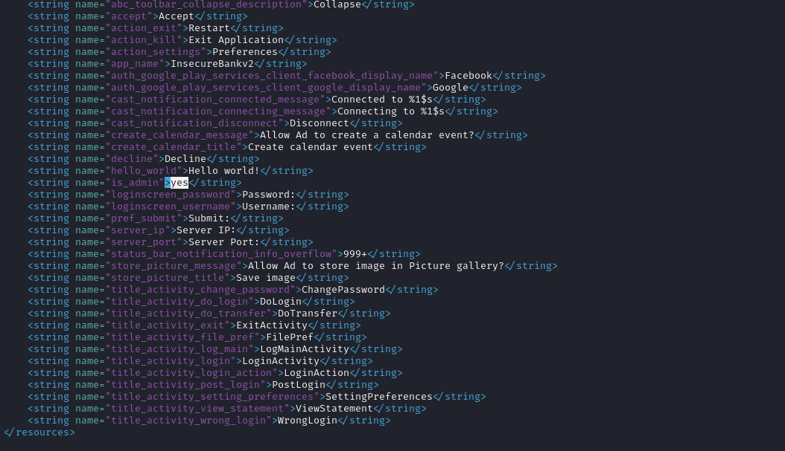

# Patch binário possibilita acesso a usuário com privilégios administrativos

## Descrição

Por meio da depuração do código fonte do aplicativo é possível observar que o recurso de verificação de adminitrador pode ser alterado, possibilitando acesso do invasor a ambiente indevido. Após decompilar o apk é possível acessar o arquivo xml de strings do programa. Ali é possivel verificar a existencia da verificação "is_admin". Quando alterado seu valor booleano de no para yes, recompilado e reassinado, varifica-se o acesso a uma plataforma com acesso a criação de usuários.   

## Referências 

https://mas.owasp.org/MASTG/techniques/android/MASTG-TECH-0013/

https://mas.owasp.org/MASTG/techniques/android/MASTG-TECH-0012/#bypass-custom-certificate-pinning-statically

https://mobile-security.gitbook.io/mobile-security-testing-guide/general-mobile-app-testing-guide/0x04c-tampering-and-reverse-engineering

https://www.ragingrock.com/AndroidAppRE/

https://apktool.org/

https://mas.owasp.org/MASVS/11-MASVS-RESILIENCE/

## Impacto

Com o acesso adminsitrativo no aplicativo, o atacante pode criar usuários não autorizados sem cumprir os requisitos definidos pela empresa detentora dos direitos do aplicativo.

## Prova de conceito

Afim de realizar o reconhecimento das funcioanlidades do aplicativo, pode-se decompilar o apk utilizando JADX. Através da análise estática pode-se localizar os possíveis pontos fracos da aplicação como a alteração de verificação do admin. 




Para conseguir acesso ao arquivo que será alvo de alteração, é necessário decopilar o aplicativo. Para isso é possível utilizar a ferramenta apktool com o seguite comando:

```
apktool d InsecureBankv2.apk
```

Serão gerados diversas pastas das quais o alvo de alteração se encontra no caminho IsecureBankv2/res/values. O arquivo onde foi encontrado o possível ponto de alteração é o string.xml que poder ser aberto e editado com qualquer editor de texto. 



Após realizar a alteração, é necessario recompilar o apk apontando o apktool para o diretório gerado na decopilação com a seguinte comando:

```
apktool b /InsecureBrankv2
```

Com o aplicativo compilado, basta gerar e realizar uma nova assinatura através da ferramenta keytool e jarsingner 

```
keytool -genkey -v -keystore patch.keystore -alias patchKeystore -keyalg RSA -keysize 2048 -validity 10000 
```

```
jarsigner -verbose -sigalg SHA1withRSA -digestalg SHA1 -keystore patch.keystore InsecureBankv2.apk patchKeystore
```
Ao carregar o apk modificado, no ambiente de teste pode-se perceber que a funcionalidade criar o usuário agora aparece. 


# Ação sugerida para mitigação

Manter a integridade da plataforma com mecanismos de Anti-Debugging e Anti-Tampering.

Impedir a instrumentação dinâmica que poderia permitir que um invasor modificasse o código em tempo de execução.

Impedir a compreensão, tornando o mais difícil possível descobrir como um aplicativo funciona por meio de análise estática usando mecanismos de encriptação, ofuscação de código e packeamento.


# Mitigação baseada em códigos

## Checking the debuggable flag in Application info
In the manifest file, the android.debuggable attribute determines whether the JDWP
thread should start for the application. It is possible to retrieve its value programmatically by using the ApplicationInfo object. If the flag is set, the manifest has been tampered with and now permits debugging.

```
public static boolean isDebuggable(Context context){
return ((context.getApplicationContext().getApplicationInfo().flags &
ApplicationInfo.FLAG_DEBUGGABLE) != 0);
}
```

## Checking if a JDWP debugger is attached
The android.os.Debug class offers a method to determine if a debugger is connected.

```
public static boolean detectDebugger() {
return Debug.isDebuggerConnected();
}
```

## Checking TracerPid
if we inspect the status file of the debugged process, located at either /proc/<pid>/status or /proc/self/status, we can see that the TracerPid field has a value different from 0, indicating that the process is being debugged.

```
$ adb shell ps -A | grep com.example.hellojni
u0_a271 11657 573 4302108 50600 ptrace_stop 0 t com.example.hellojni
$ adb shell cat /proc/11657/status | grep -e "^TracerPid:" | sed
"s/^TracerPid:\t//"
TracerPid: 11839
$ adb shell ps -A | grep 11839
u0_a271 11839 11837 14024 4548 poll_schedule_timeout 0 S lldb-server
```
