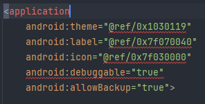
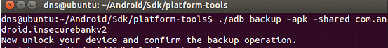
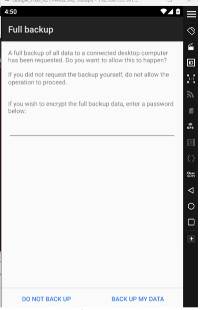
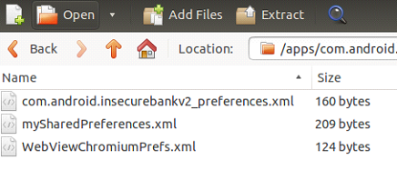

# Bypass na lógica de backup de credenciais do programa

## Descrição

Por meio da depuração do manifesto do programa, podemos identificar a lógica de backup de dados e credenciais, assim permitindo o bypass e manipulação de dados.

## Referências

https://mas.owasp.org/MASTG/tools/android/MASTG-TOOL-0004/

https://mas.owasp.org/MASTG/techniques/android/MASTG-TECH-0001/#connect-to-a-device-over-wi-fi

https://mas.owasp.org/MASTG/techniques/android/MASTG-TECH-0014/

https://xdaforums.com/t/backup-restore-your-appdata-savegame-between-phones-adb-shell-non-root.4378323/

https://mas.owasp.org/MASVS/05-MASVS-STORAGE/

https://mas.owasp.org/MASVS/06-MASVS-CRYPTO/

## Impacto

O acesso não autorizado no sistema de backup de um aplicativo pode resultar em comprometimento da integridade dos dados armazenados no aplicativo, vazamento de informações sensíveis e potencial violação de privacidade dos usuários. Além disso, o acesso não autorizado pode levar a atividades maliciosas, como fraude, roubo de identidade e acesso não autorizado a recursos protegidos.

## Prova de conceito

A falha pode ser vista no próprio AndroidManifest.xml, com uma linha exposta com o seguinte argumento : **android:debuggable="true"** /  **android:allowBackup="true" .** Quando a configuração está  “true“ o aplicativo fica habilitado para depuração, o que significa que ele pode ser facilmente manipulado e analisado por terceiros, incluindo atacantes. Com isso, podemos manipular os dados de Backup.



Portanto precisamos criar um backup é usado para criar um backup do aplicativo “**com.android.insecurebankv2”**,  incluindo seu arquivo APK e dados compartilhados:

```
adb backup -apk -shared com.android.insecurebankv2

```

Ao rodarmos o comando, o adb logo pede uma autenticação. Isso ocorre porque o comando **“adb backup”** requer interação direta do usuário para garantir que o backup seja autorizado.





Após realizar o comando, podemos cancelar a operação de backup do Android, pois ele cria um **Backup Incremental,** essa operação do Android basicamente cria um arquivo de backup temporário no formato AB (**`backup.ab`**). Este arquivo é usado para armazenar os dados que foram copiados até o **momento**:

```
 **backup.ab**
  
  
```

Com o **backup.ab** em nossa máquina, ler o conteúdo do arquivo backup.ab e decodificar para base64 , decodificar o conteúdo base64 para bytes,  remover os primeiros 24 bytes , salvar os bytes em um arquivo temporário , descompactar o arquivo zlib (em ordem).

```

cat backup.ab | (dd bs=24 count=0 skip=1; cat) | zlib-flate -uncompress > backup_compressado.tar

```

Assim, teremos as credenciais dentro de um xml:




# Ação sugerida para mitigação

O aplicativo emprega criptografia forte nos dados confidenciais que são armazenados localmente, como por exemplo o ***backup***. Também emprega o uso de par de chaves e o correto armazenamento das mesmas.

Os locais de armazenamento devem ser privados do aplicativo, sendo possível apenas acessar através do aplicativo.


