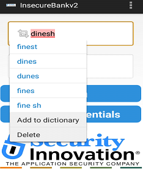
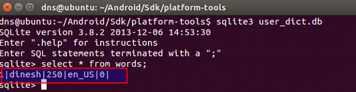

## Descrição

O Android tem um dicionário, onde as palavras inseridas por um usuário podem ser salvas para correção automática futura. Este dicionário de usuário está disponível para qualquer aplicativo sem permissões especiais. Em um cenário de ataque, essa vulnerabilidade pode resultar em grandes vazamentos de dados e no bypass do login.

## Referências

https://mas.owasp.org/MASTG/tests/android/MASVS-STORAGE/MASTG-TEST-0006/

https://codeql.github.com/codeql-query-help/java/java-android-sensitive-keyboard-cache/

https://github.com/OWASP/owasp-mastg/blob/master/Document/0x05d-Testing-Data-Storage.md#determining-whether-the-keyboard-cache-is-disabled-for-text-input-fields-mstg-storage-5

https://mas.owasp.org/MASVS/05-MASVS-STORAGE/

## Impacto

O impacto da vulnerabilidade do cache do teclado Android implica que em um cenário de ataque, essa vulnerabilidade pode resultar em grandes vazamentos de dados e no bypass do login do banco.

## Prova de conceito

Primeiro, para explorarmos essa vulnerabilidade, temos que tentar logar com qualquer username e usar a opção  **“Add to dictionary”** para salvar no cache.



Após tentarmos logar, vamos dar uma olhada no  “***user*_dict.db”,** que seria o database de usuários do aplicativo:

```
./adb pull /data/data/com.android.providers.userdictionary/databases/user_dict.db

```

Depois de baixar o dicionário de usuários, vamos ler o database com o “**sqlite3”:**

```
sqlite3 user_dict.db
```

Usamos o comando SQL para ler o cache do teclado:

```bash
select * from words;
```

Podemos observar o usuário digitado anteriormente:



## Ação sugerida para mitigação

Informações confidenciais não devem ser armazenadas em banco de dados SQLite não criptografados. A biblioteca SQLCipher pode ser usada para a criptografia dos dados necessáros com a chave de recuperação armazenada no servidor.

### Referência

https://github.com/OWASP/owasp-mastg/blob/master/Document/0x05d-Testing-Data-Storage.md#determining-whether-the-keyboard-cache-is-disabled-for-text-input-fields-mstg-storage-5
