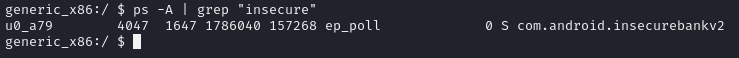
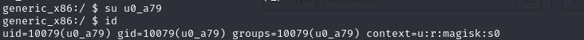
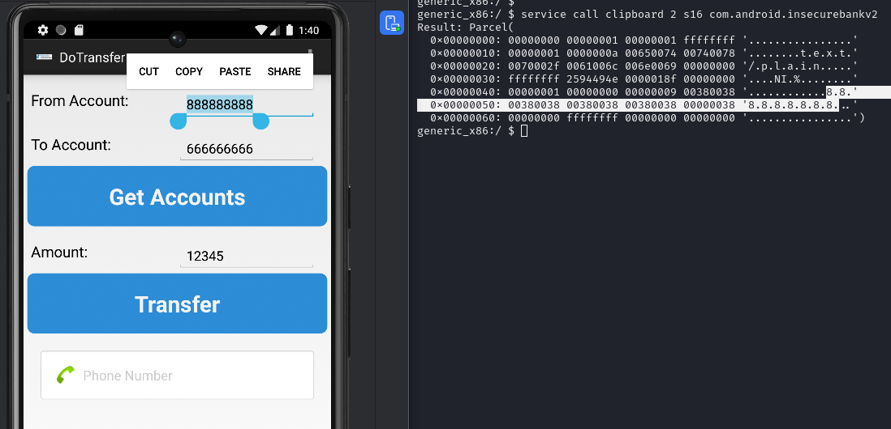

# Extração da dados enviados para a área de transferência

## Descrição

O aplicativo permite a extração dos dados na área de transferencia. Com acesso a shell do disposistivo é possível extrair as informações que o usuário alvo copiou de dentro do aplicativo.

## Referências

https://www.guardsquare.com/mobile-app-security-research-center/malware/clipboard-hijacking#:~:text=Android%20mobile%20malware%20can%20target,any%20data%20copied%20to%20it.

https://mas.owasp.org/MASTG/Android/0x05d-Testing-Data-Storage/#overview

## Impacto

A exposição dos dados enviados para a área de transferência pode culminar no vazamento de informações sensíveis como números e pins do cartão de crédito. O ataque pode acontecer caso o dispositivo esteja comprometido com malware de extração de dados ou a invasor tiver acesso ao dispositivo da vítima. 

## Prova de conceito

Para verificar esta vulnerabilidade é precisar estar na shell do dispositivo para encontrar o id do processo do aplicativo. Isso pode ser feito com o seguinte comando: 

```
adb shell
```

```
ps -A | grep "Insecure"
```
O retorno vai indicar o nome do processo alvo, filtrado pelo termo **insecure**. 



Essa informação é utilizada para alterar o usuário atual para o processo idicado.



Nesta posição, basta solicitar a impressão dos valores registrados na área de transferencia. Com o seguinte comando:

```
service call clipboard 2 s16 com.android.insecurebankv2
```



## Ação sugerida para mitigação

Impedir a cópia para a área de transferência pode trazer grandes incovenientes para o usuário final. Por isso é necessario a implementação de um sistema de gerenciamento personalizado  de controle, sobre quais dados podem ser copiados. 

Um filtro pode controlar quando e quando os dados podem ser copiados e potencialmente criptografá-los antes de serem colocados na área de transferência.

### Referencias

https://www.guardsquare.com/mobile-app-security-research-center/malware/copying-protection
